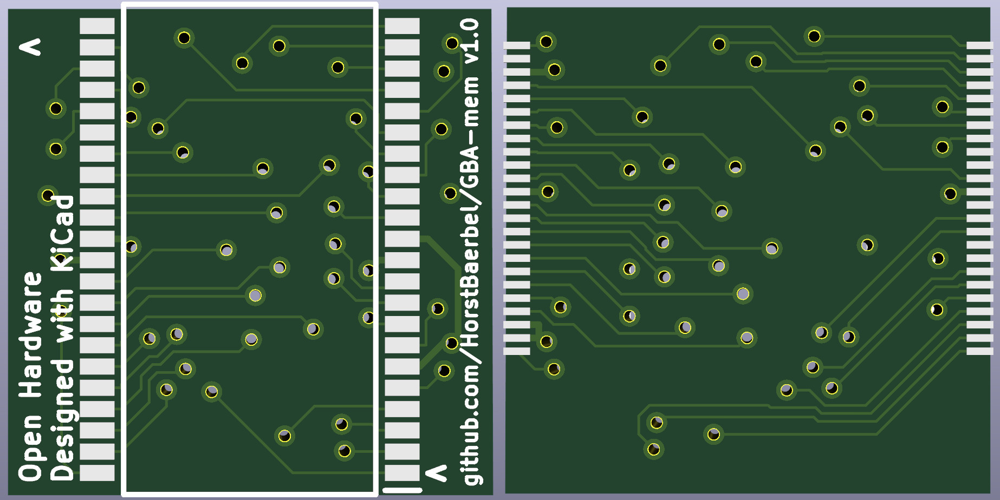
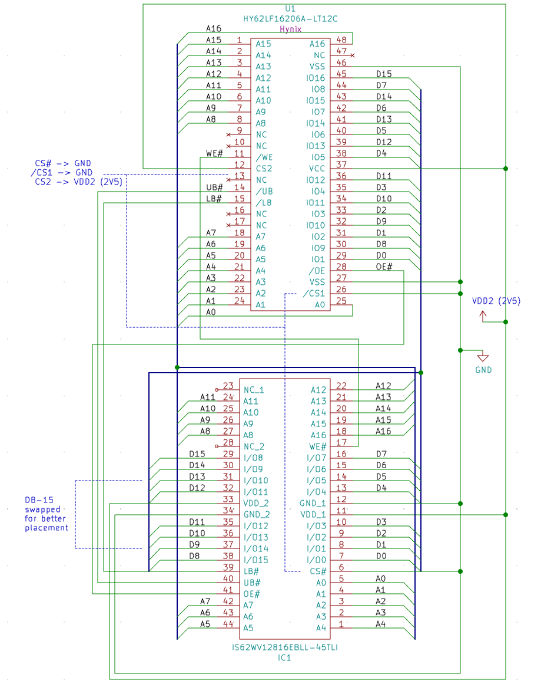
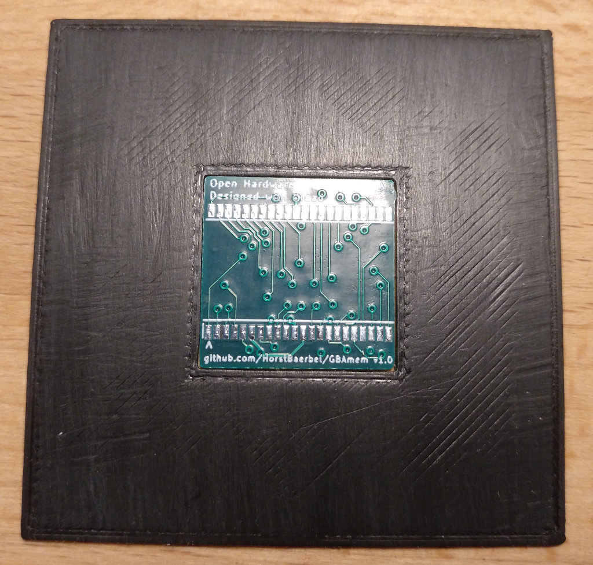
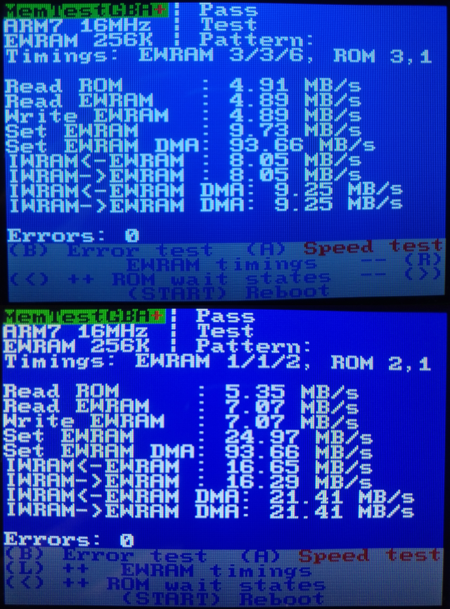

<p align="center">
    <span>
        <font size="12">Here be dragons🐉!</font></br>
        <font size="4">This killed my GBA. I probably fried the power supply IC. I'm leaving this here for academic purposes...</font>
    </span>
</p>

# Game Boy Advance faster EWRAM hack

The GBA has 256kB of external work RAM in the form of an 128kx16 SRAM chip with 70ns (M68AS128DL70N6), 85ns ([μPD442012AGY-BB85X-MJH](http://www.dexsilicium.com/Nec_D442012AGY.pdf)), or even 120ns ([HY62LF16206A-LT12C](https://www.alldatasheet.com/datasheet-pdf/pdf/96180/HYNIX/HY62LF16206A.html)) access time, depending on the chip (good hardware database [here](https://gbhwdb.gekkio.fi/consoles/agb/)). The regular EWRAM access speed is 2 wait states (3/3/6 clock cycles) for 1/2/4 bytes of data. Setting the [undocumented EWRAM wait states flags](http://problemkaputt.de/gbatek.htm#gbasystemcontrol) to 0Eh allows you to speed up EWRAM access to 1 wait state (2/2/4 clock cycles). Setting it to 0Fh will crash / lock up the GBA though, because 0 wait states are out of the specs of all SRAM chips ever used in the GBA / GBA SP and GBA Micro (access times must be < 62ns) and EWRAM gets corrupted (see [testing memory](#testing-memory)). The choice of those SRAM chips back in 2000 was probably due availability and keeping the system costs down, but 20 years later there are cheap SRAM chips available with as low as 10ns access time, so...

## The hardware

This aims to replace the GBAs SRAM chip with a faster chip on a carrier board, because there seem to be no pin-compatible models anymore. The old models used a TSOP-I-48 footprint, newer models use a TSOP-II-44 footprint and all have a very different pinout.

<p align="center">
    <span>
        
    </span>
</p>

All pins have been connected straight through, with the exception of /CS1 (/CE1) and CS2 (CE2) which are permanently connected to GND resp. VDD2 / 2.5V anyway according to [GBATEK](http://problemkaputt.de/gbatek.htm#pinoutscpupinouts). Also the upper byte lines (D8-D15) are swapped for better chip placement.

<p align="center">
    <span>
        
    </span>
</p>

Supposedly compatible SRAM chips for the board:

| Model                                                                                                                    | min. access time | max. power draw | working     |
| ------------------------------------------------------------------------------------------------------------------------ | ---------------- | --------------- | ----------- |
| [IS62WV12816BLL-55TLI / -55BLI](http://www.issi.com/WW/pdf/62WV12816ALL.pdf)                                             | 55ns             | ~25mA           | NO (tested) |
| [IS62WV12816EBLL-45TLI](http://www.issi.com/WW/pdf/62-65WV12816EALL-BLL.pdf)                                             | 45ns             | ~15mA           | ?           |
| [CY62136FV30LL-45ZSXIT / -45ZSXI / -45ZSXA](https://www.cypress.com/file/43866/download)                                 | 45ns             | ~18mA           | ?           |
| [CY62136ESL-45ZSXI](https://www.mouser.de/datasheet/2/100/001-48147_CY62136ESL_MoBL_R_2-Mbit_128_K_X_16_Stat-319203.pdf) | 45ns             | ~20mA           | ?           |

The power draw of the replacement chips seems to be comparable to that of the originals. I'd go with the IS62WV12816EBLL-45TLI if you can find it, because of the lowest power draw.

## Making your own boards

The [KiCad](KiCad) directory contains the schematics and PCB layout and also gerber files (exported for JLPCB). I chose [JLPCB](https://jlcpcb.com) as a manufacturer in this case and a board thickness of 0.8mm. Remember to get a stencil made for both sides.

### Soldering

I opted for [ChipQuik Sn42/Bi58 TS391LT](https://www.amazon.de/gp/product/B0195V1QEI) solder paste because of its low melting point of 138°C. This makes it easier to solder and you need to heat up the GBA mainboard less. You can 3D-print a [PCB holder](STL/PCB_holder.stl) for the PCB to apply solder paste with the stencil:

<p align="center">
    <span>
        
    </span>
</p>

## Testing memory

You can use the [MemTestGBA binary](MemTestGBA.gba) to test stability and performance (on a REAL AGB/AGS Game Boy Advance, [NOT on the DS / DS lite or a GBA micro](http://problemkaputt.de/gbatek.htm#gbasystemcontrol)):

<p align="center">
    <span>
        
    </span>
</p>

It will test the ROM read, EWRAM read / write and IWRAM ⟷ EWRAM copy speed (startup default, Button **A**). Memory is copied in 24kB blocks, so this is not the max. speed possible, but gives a ballpark number. You can also test the memory for errors ([Memtest86+](http://www.memtest.org/)-like, Button **B**). Buttons **L** and **R** let you increase or decrease the EWRAM timings, **⟵** and **⟶** let you increase or decrease the ROM wait states and **START** reboots the GBA. The source code can be found in the [src](src) directory.  
**Theoretical** EWRAM SRAM chip transfer speeds should be: Clock speed * 2 (16 bit SRAM width) / (1 + wait states) ⟷ 16 * 1024 * 1024 * 2 / (1 + w) = 10.6 MB/s (default 2 wait states) and 32 MB/s (0 wait states).

## How to build the test binary?

### From the command line

* You **must** have [CMake](https://cmake.org/) 3.1.0 or higher, [devkitPro / devKitARM](https://devkitpro.org) r54 or higher [installed](https://devkitpro.org/wiki/Getting_Started).
* Navigate to the [src](src) folder, then:

```sh
mkdir build && cd build
cmake -DCMAKE_BUILD_TYPE=Release ..
make -j $(grep -c '^processor' /proc/cpuinfo 2>/dev/null)
```

### From Visual Studio Code

* You **must** have [CMake](https://cmake.org/), [devkitPro / devKitARM](https://devkitpro.org) r54 or higher [installed](https://devkitpro.org/wiki/Getting_Started).
* **Must**: Install the "C/C++ extension" by Microsoft.
* **Recommended**: If you want intellisense functionality install the "C++ intellisense" extension by austin.
* **Must**: Install the "CMake Tools" extension by Microsoft.
* Restart / Reload Visual Studio Code if you have installed extensions.
* Open the GBAmem folder using "Open folder...".
* Choose "Unspecified" as your active CMake kit if asked. It then should be autodetected correctly.
* You should be able to build now using F7 and build + run using F5.

## License

If you want to build your own soft- or hardware based on this, you can. See the [MIT LICENSE](LICENSE).  
The "Modern DOS" 8x8 font is from [Jayvee Enaguas](https://notabug.org/HarvettFox96/ttf-moderndos) and used by [CC0](https://notabug.org/HarvettFox96/ttf-moderndos/src/master/LICENSE).  
The CMake build scripts / toolchain is from [Thomas Farr](https://github.com/Xtansia/3ds-cmake) and uses the [MIT LICENSE](3ds-cmake/LICENSE).

## Todo

* Move all of the code to IWRAM
* Use framework
* Test IS62WV12816EBLL-45TLI
* Try out [AGZ PCB](https://github.com/Zekfoo/AGZ)
